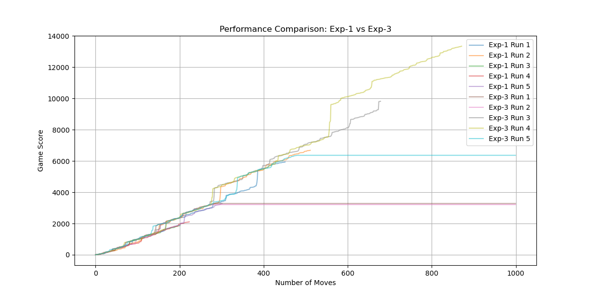

# Expectimax 2048 AI



## Overview
This project implements an AI agent for the game 2048 using the Expectimax algorithm. The agent is designed to make optimal moves by evaluating possible future game states, and can be compared to human play or other strategies. The project includes a playable game interface, automated experiments, and performance visualizations.

## Features
- **AI Agent**: Uses the Expectimax algorithm to determine the best move.
- **Game Engine**: Handles all 2048 mechanics, including tile movement, merging, and random tile placement.
- **User Interface**: Play manually or let the AI play automatically. Supports various board sizes and extra credit evaluation.
- **Testing**: Includes automated tests for correctness and performance.
- **Visualization**: Generates plots comparing AI performance with different settings.

## Installation
1. Clone the repository:
    ```sh
    git clone https://github.com/WeiHanTu/expectimax-main.git
    cd expectimax-main
    ```
2. Install the required dependencies:
    ```sh
    pip install -r requirements.txt
    ```

## Usage
To start the game:
```sh
python main.py
```

### Keyboard Controls
- **Arrow Keys**: Move tiles manually
- **Enter**: Toggle AI play
- **r**: Restart the game
- **u**: Undo a move
- **3-7**: Change board size
- **g**: Toggle grayscale
- **e**: Switch to extra credit mode

## Running Tests
To run the test suite:
```sh
python main.py -t 1
```

## AI Implementation
The AI agent uses the Expectimax algorithm to evaluate possible future game states up to a specified depth, choosing the move that maximizes expected score. The agent supports both a basic evaluation (score) and an advanced evaluation (extra credit) that considers:
- Number of empty cells
- Monotonicity (ordered tiles)
- Smoothness (adjacent tile similarity)
- Corner preference
- Merge potential

### Example Plots
Basic comparison:


Advanced evaluation comparison:


## File Structure
- `main.py`: Game entry point and UI
- `ai.py`: AI agent and experiment code
- `game.py`: Game mechanics engine
- `test.py`: Test suite
- `test_states`, `test_sols`: Test data
- `figs/`: Performance plots

## License
This project is licensed under the MIT License.